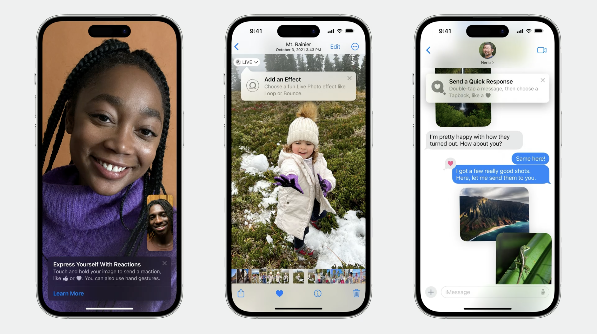
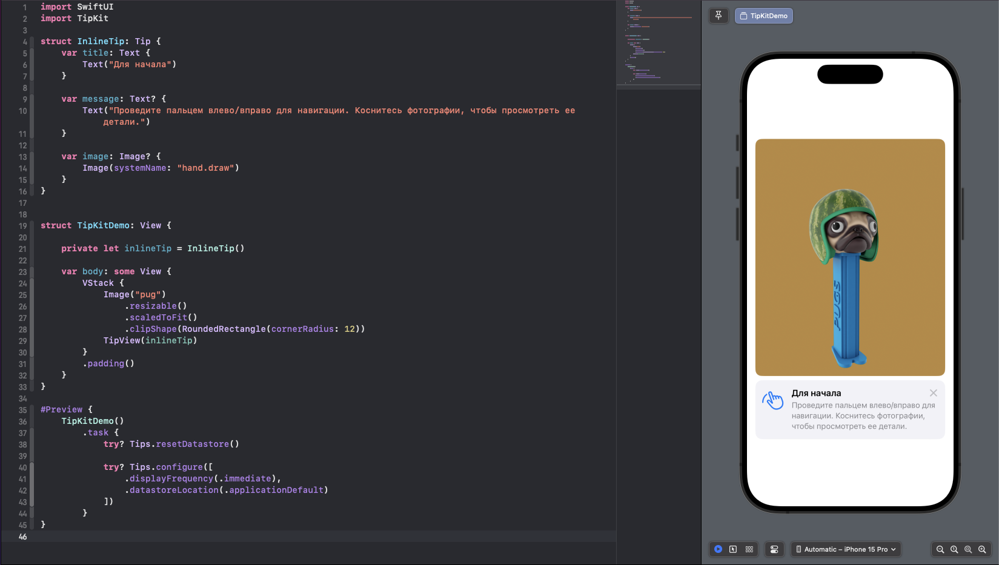
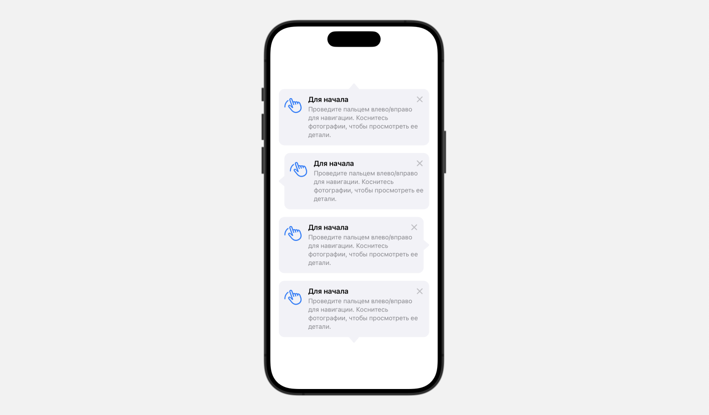
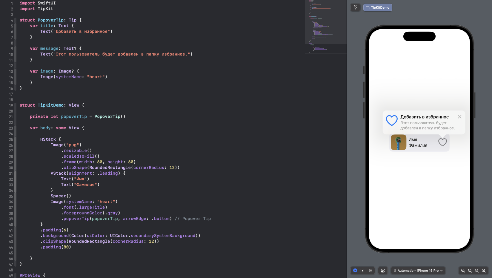
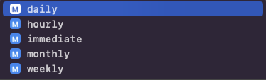

>[TipKit](https://developer.apple.com/documentation/tipkit) - это новый фреймворк представленная Apple на WWDC 2023, доступнуй в iOS 17. Он позволяет легко отображать подсказки в ваших приложениях.

TipKit может рассказать о новой функции, помочь им обнаружить скрытые параметры или показать более быстрый способ выполнения задачи. Доступно для iPhone, iPad, Mac, Apple Watch и Apple TV

# Виды подсказок

Существует два вида подсказок:

>Всплывающее (popover): отображается в виде наложения на пользовательский интерфейс приложения, что позволяет ориентировать пользователей, не меняя представления.

>Встраиваемое (inline): временно перестраивает пользовательский интерфейс приложения вокруг себя, чтобы ничего не было перекрыто (недоступно в tvOS)

# Начало работы с TipKit
Импортируйте TipKit в свой проект

```swift
    import TipKit
```

# Протокол Tip

Чтобы создать подсказку необходимо принять протокол Tip, для настройки содержимого подсказки. Подсказки состоят из `title`(заголовка) и `message`(краткого описания). При желании вы можете добавить `image`(изображение), которое будет ассоциироваться с подсказкой.

```swift
    struct InlineTip: Tip {
        var title: Text {
            Text("Для начала")
        }
    
        var message: Text? {
            Text("Проведите пальцем влево/вправо для навигации. Коснитесь фотографии, чтобы просмотреть ее детали.")
        }
    
        var image: Image? {
            Image(systemName: "hand.draw")
        }
    }
```

# Inline Tip

Чтобы отобразить подсказку, вы можете создать экземпляр `TipView` в подходящем для вас месте и передать ему подсказку для отображения.

```swift
    struct TipKitDemo: View {
    
        private let inlineTip = InlineTip()

        var body: some View {
            VStack {
                Image("pug")
                    .resizable()
                    .scaledToFit()
                    .clipShape(RoundedRectangle(cornerRadius: 12))
                TipView(inlineTip) // Inline Tip
            }
            .padding()
        }
    }
```



Так же можно указать `arrowEdge` - напраление стрелочки подсказки.

```swift
    TipView(inlineTip, arrowEdge: .top)
    TipView(inlineTip, arrowEdge: .leading)
    TipView(inlineTip, arrowEdge: .trailing)
    TipView(inlineTip, arrowEdge: .bottom)
```



# Popover Tip

Чтобы отображать подсказку в виде всплывающего окна, вы можете прикрепить модификатор `popoverTip` кнопке или другим элементам пользовательского интерфейса.

```swift
struct TipKitDemo: View {
    
    private let popoverTip = PopoverTip()
    
    var body: some View {
        
        HStack {
            Image("pug")
                .resizable()
                .scaledToFill()
                .frame(width: 60, height: 60)
                .clipShape(RoundedRectangle(cornerRadius: 12))
            VStack(alignment: .leading) {
                Text("Имя")
                Text("Фамилия")
            }
            Spacer()
            Image(systemName: "heart")
                .font(.largeTitle)
                .foregroundColor(.gray)
                .popoverTip(popoverTip, arrowEdge: .bottom) // Popover Tip
        }
        .padding(6)
        .background(Color(uiColor: UIColor.secondarySystemBackground))
        .clipShape(RoundedRectangle(cornerRadius: 12))
        .padding(80)
        
    }
}
```



# Добавление кнопок действия

Пока что созданные ранее подсказки носили чисто информационный характер. Но мы можем добавить `actions`(действия), чтобы подсказки были более интерактивными и имели расширенные возможности.

### Создаем подсказку

```swift
    struct PasswordTip: Tip {
        var title: Text {
            Text("Нужна помощь?")
        }
        var message: Text? {
            Text("Вам нужна помощь со входом в свою учетную запись??")
        }
        var image: Image? {
            Image(systemName: "lock.shield")
        }
        var actions: [Action] {
            Action(id: "reset-password", title: "Сбросить Пароль")
            Action(id: "not-reset-password", title: "Отменить сброс")
        }
    }
```

### Добавляем подсказку 

Обратите внимание на замыкание в `TipView`, по `action.id` мы можем обратиться к нашим `actions`.

```swift
    struct ActionTip: View {
        @State private var textFieldData = ""
        @State private var isShowRessetField = false
        
        private var tip = PasswordTip()
        
        var body: some View {
            VStack(spacing: 20) {
                Spacer()
                TipView(tip, arrowEdge: .bottom) { action in
                    
                    if action.id == "reset-password" {
                        isShowRessetField = true
                    }
                    
                    if action.id == "not-reset-password" {
                        isShowRessetField = false
                    }
                    
                }
                Button("Войти") {}
                TextField("Введите новый пароль", text: $textFieldData)
                    .textFieldStyle(.roundedBorder)
                    .opacity(isShowRessetField ? 1 : 0)
                Spacer()
            }
            .padding()
        }
    }
```

<video src="action-tipkit.mp4" controls></video>

# Отказаться от подсказки

Подсказку можно отклонить, нажав на крестик. Так же можно программно закрыть подсказку, используя метод `invalidate` и  указав причину.

>`actionPerformed` - означает, что пользователь выполнил действие, описанное в подсказке.

```swift
    inlineTip.invalidate(reason: .actionPerformed)
```

# Настроить правила 
TipKit позволяет создавать отдельные правила `rules` для каждой подсказки и применять эти правила, чтобы определить следует ли отображать подсказку. 

Правила используются для определения отображения или неотображения подсказки на основе определенных состояний `@Parameter` или пользовательских событий, поэтому сначала нам необходимо определить необходимые параметры и события в структуре Tip.

## Создаем подсказку с правилами

Создаем параметр `hasViewedGetStartedTip` со значением **false** и правило `Rule`, оно проверяет значение переменной  `hasViewedGetStartedTip`, указывая что подсказка должна отображаться, когда значение равно true.

```swift
    struct FavoriteRuleTip: Tip {
    
        var title: Text {
            Text("Добавить в избранное")
        }
        
        var message: Text? {
            Text("Этот пользователь будет добавлен в папку избранное.")
        }
    
        var rules: [Rule] {
            #Rule(Self.$hasViewedGetStartedTip) { $0 == true }
        }
    
        @Parameter
        static var hasViewedGetStartedTip: Bool = false
    }
```

## Создаем стартовую подсказку

```swift
struct GettingStartedTip: Tip {
    var title: Text {
        Text("Начало работы")
    }
    
    var message: Text? {
        Text("Коснитесь фотографии, чтобы просмотреть ее детали.")
    }
    
    var image: Image? {
        Image(systemName: "hand.tap")
    }
}
```
## Добавляем подсказки

```swift
struct ParameterRule: View {
    @State private var showDetail = false
    
    private var favoriteRuleTip = FavoriteRuleTip()
    private var gettingStartedTip = GettingStartedTip()
    
    var body: some View {
        VStack {
            ZStack(alignment: .topTrailing) {
                Image("pug")
                    .resizable()
                    .scaledToFit()
                    .clipShape(RoundedRectangle(cornerRadius: 14))
                Image(systemName: "heart")
                    .padding()
                    .font(.largeTitle)
                    .foregroundStyle(.white)
                    .popoverTip(favoriteRuleTip, arrowEdge: .top)
            }
            .onTapGesture {
                withAnimation {
                    showDetail.toggle()
                }
                
                // пользователь выполнил действие описанное в подсказке, отключаем подсказку
                gettingStartedTip.invalidate(reason: .actionPerformed)
                
                FavoriteRuleTip.hasViewedGetStartedTip = true
            }
            if showDetail {
                Text("Мопс - приземистая собака с почти квадратным телом и приплюснутой мордочкой с обилием складок. У нее широко расставленные круглые умные глаза и характерная походка. Несмотря на кажущуюся неповоротливость собаки, она пружинистая, элегантная. При передвижении задняя часть тела перекатывается, а передние конечности отталкиваются.")
            } else {
                TipView(GettingStartedTip())
            }
            Spacer()
        }
        .padding()
    }
}
```

При запуске приложения отображается только подсказка «Начало работы». Однако, как только вы коснетесь изображения чтобы закрыть подсказку, приложение отобразит подсказку «Избранное».


<video src="rules-tipkit.mp4" controls></video>

# Добавляем отображение подсказок в свое приложении

Чтобы включить отображение подсказок в приложении, в точке входа вашего придожения импортируйте `TipKit` и добавление `Tips.configure`.

>`displayFrequency` - частота отображения, `immediate` значить что посказки будут отображаться сразу.  
  

>`datastoreLocation` - расположение хранилища данных, по умолчанию является каталогом `support` вашего приложения.

```swift
    import SwiftUI
    import TipKit

    @main
    struct TipKitExampleApp: App {
        var body: some Scene {
            WindowGroup {
                TipKitDemo()
                    .task {
                        try? Tips.configure([
                            .displayFrequency(.immediate),
                            .datastoreLocation(.applicationDefault)
                        ])
                    }
            }
        }
    }
```

# Preview TipKit

Чтобы подсказки были доступны в предварительном просмотре, необходимо настроить `Tips` и для `#Preview`

Обратите внимание, на строку кода для сброса хранилища данных `Tips.resetDatastore()`. 

Если вы закроете подсказку, то она больше не будет отображаться в приложении. Поэтому для предварительного просмотра, рекомендуется сбросить хранилище данных.

```swift
    #Preview {
        TipKitDemo()
            .task {
                try? Tips.resetDatastore()
                
                try? Tips.configure([
                    .displayFrequency(.immediate),
                    .datastoreLocation(.applicationDefault)
                ])
            }
    }
```